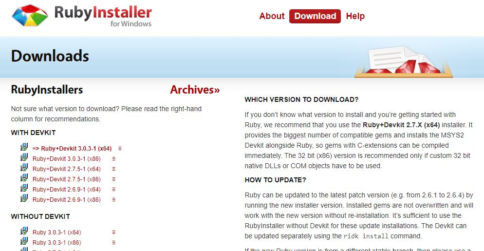
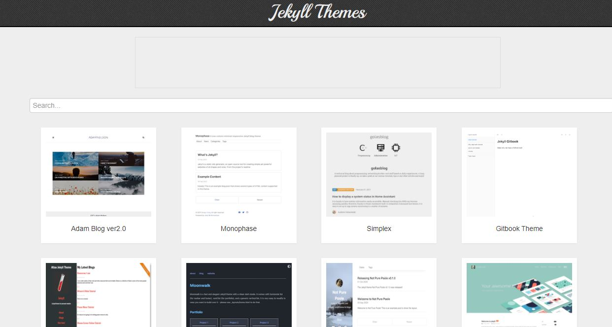
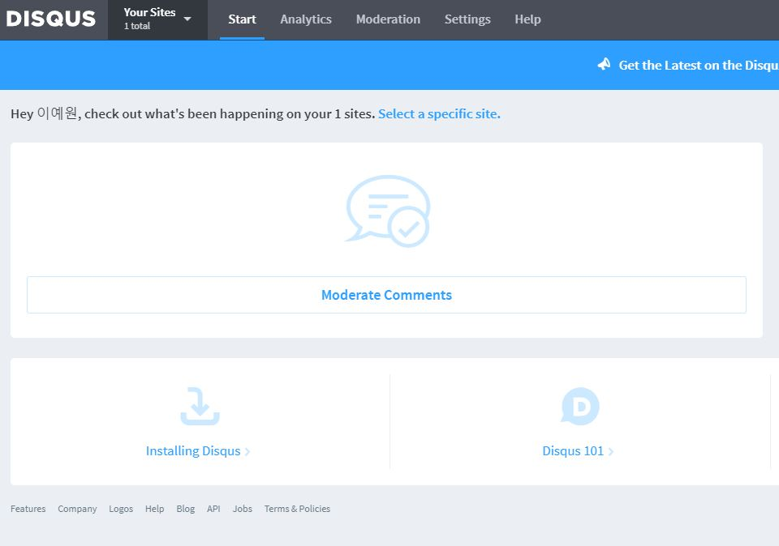
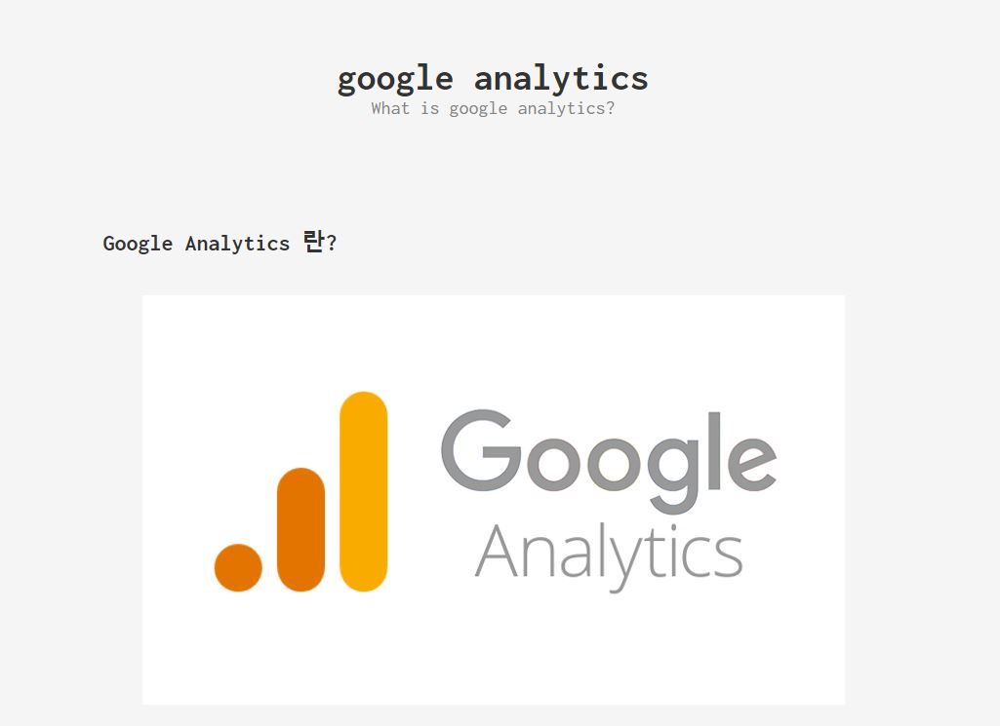

Process
1. repository 생성
2. jekyll 설치
3. 깃허브에 jekyll적용
4. 댓글기능추가
5. Favicon 
6. Google Analytics 적용

---

## 1. repository 생성
* Github에 새로운 repository를 <username>.github.io로 생성


---

## 2. jekyll 설치
[Ruby설치링크](https://rubyinstaller.org/downloads/)

* 위 링크에서 Ruby 설치
* jekyll 설치
* bundler 설치
* `jekyll new .` 으로 블로그 생성
* `jekyll serve`로 실행

---

## 3. 테마 적용
[테마모음사이트](http://jekyllthemes.org/)

* 위 링크에서 마음에 드는 테마 탐색
* 테마 결정 후 해당 깃허브에 들어가 클론
* 클론한 파일을 내 디렉토리에 적용

---

## 4. 댓글기능추가
[disqus official](https://disqus.com)

* 위 링크에 접속하여 회원가입
* Create Site를 클릭하여 생성
* Admin > installing Disqus > Universal Embed Code

* _layouts/post.html에 Universal Embed Code 추가
* _config.yml에 코드 추가
```
comment:
    provider:"disqus"  
    disqus:  
      shortname: "<username>"
```

* 댓글기능을 추가하고 싶은 게시글에
`comment: ture` 추가

---

## 5. Favicon 적용

* 원하는 이미지를 .ico파일로 변환
* 변환한 파일을 favicon.ico파일로 저장 후 압축해제
* 사용할 파비콘 경로 확인 --> `assets/favicon.ico/favicon.ico `
* `<head>`태그에 `<link rel="icon" href="/assets/favicon.ico/favicon.ico" type="image/x-icon" sizes="16x16">` 코드 추가
  * 테마마다 `<head>`태그 위치가 다르기 때문에  _includes > meta_tags > base.html에 추가

---

## 6. Google Analytics 적용
* google analytics에 접속하여 계정 생성
* jekyll 설정변경
* 자세한 사항은 아래 링크 참고
[scarletyewon.github.io/google-analytics](https://scarletyewon.github.io/productivity/2021/12/10/google-analytics.html)

